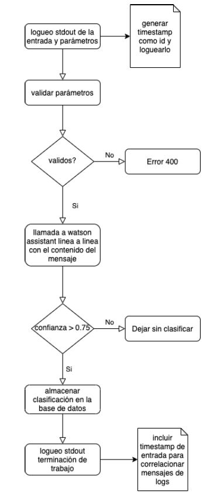

# IBMRestApi2020

En este repositorio, se encuentra la solución a la alternativa 1 (Rest api con firma /mail/classify)

## Introducción

Como consigna, se pide que se cree una aplicación rest utilizando cualquier lenguaje de programación que reciba un mensaje específico y lo clasifique dependiendo de su contenido. Finalmente, este mensaje se guardará en una base de datos.

## Caso de aplicación

Cuando se crea una aplicación que recibe mensajes, resulta tedioso tener que reconocer el objetivo por el cual fueron escritos. Esta aplicación busca solucionar esto, utilizando una instancia de Watson Assistant para reconocer el contenido de un mensaje y clasificarlo acordemente. En este caso, se define una app que recibe mensajes de clientes hacia un banco. Al recibirse el mensaje, se verificará que el cuerpo del mismo contiene todos los parámetros pertinentes definidos dentro de la aplicación. Asimismo, se verificará que los tipos y valores sean los correctos.
Una vez validado el mensaje recibido, se pasará a clasificarlo utilizando la api de Watson Assistan la cuál, una vez envíado el mensaje con un request, responderá con una de tres intenciones:

* Cambio de clave
* Adelanto de sueldo
* Transferencia erronea

Una vez identificada la intención (siempre y cuando se tenga un 75% de certeza de que es la obtenida) se clasificará el mensaje y se guardará en una base de datos db2 en la cloud de ibm.

## Flujo del programa

<p align="center">
  
</p>

## Correr la aplicación

1- Clonamos el repositorio en alguna carpeta de nuestra preferencia 

```
git clone https://github.com/aparedes1998/IBMRestApi2020
```

2- Nos paramos en el repositorio clonado e instalamos las dependencias especificadas en el package.json con el siguiente comando:
```
npm install
```
3- Debemos crear una instancia de "Watson Assistant" en ibm cloud y entrenarlo para reconocer las intenciones mencionadas anteriormente. Los nombres de estas intenciones deben ser los siguientes:

* CambioDeClave
* AdelantoDeSueldo
* TransferenciaErronea

Nota: Se pueden crear las clasificaciones que uno quiera, estas fueron con las que se realizaron las pruebas pero la aplicación tomará cualquiera que se defina.

4- Una vez definido el asistente, debemos definir una base de datos db2 en ibm cloud. Una vez creada, se deberá abrir la consola y correr los siguientes scripts:

```
CREATE TABLE types(
	name VARCHAR(32) NOT NULL,
	description VARCHAR(64),
	PRIMARY KEY(name)
);

CREATE TABLE messages(
	message_id INT GENERATED BY DEFAULT AS IDENTITY NOT NULL,
	origin VARCHAR(32) NOT NULL,
	topic VARCHAR(32) NOT NULL,
	pid_country VARCHAR(32) NOT NULL,
	pid_type VARCHAR(32) NOT NULL,
	pid_number BIGINT NOT NULL,
	name VARCHAR(32) NOT NULL,
	lastname VARCHAR(32) NOT NULL,
	phone VARCHAR(32) NOT NULL,
	email VARCHAR(32) NOT NULL,
	identified_customer BOOLEAN NOT NULL,
	access_from VARCHAR(32) NOT NULL,
	msg_content VARCHAR(100) NOT NULL,	
	type VARCHAR(32) NOT NULL,
	CONSTRAINT FK_type_id FOREIGN KEY (type) REFERENCES types(name) ON DELETE CASCADE ON UPDATE RESTRICT,
	PRIMARY KEY (message_id)
);

INSERT INTO types(name,description)
VALUES('CambioDeClave', 'El usuario busca cambiar su clave de acceso');

INSERT INTO types(name,description)
VALUES('AdelantoDeSueldo', 'El usuario tiene una consulta sobre su adelanto de sueldo');

INSERT INTO types(name,description)
VALUES('TransferenciaErronea', 'El usuario tuvo un problema al realizar una transferencia');
```
Nota: Al igual que en el ejercicio anterior, los últimos 3 insert refieren a las intenciones definidas en el asistente, por lo que esto se debe rellenar con las intenciones creadas anteriormente.

5- Antes de correr la aplicación, debemos crear un archivo .env donde se setearan las variables de entorno necesarias para el programa. Una vez creado el archivo, se rellenan los contenidos de la siguiente manera:

```
DSN= <YOUR_IBM_DB2_DSN>

WATSON_API_KEY= <YOUR_WATSON_API_KEY>
WATSON_SERVICE_URL= <YOUR_WATSON_SERVICE_URL>
WATSON_ASSISTANT_ID=<YOUR_WATSON_ASSISTANT_ID>
```
Todas estas credenciales se encontrarán ubicadas en el gestor de recursos en ibm cloud para cada uno de los servicios.

6- Finalmente, podremos correr la aplicación localmente con el comando:

```
npm start
```
o con
```
node app.js
```
A continuación, tendrá su aplicación corriendo en localhost con el puerto 3000. Para realizar una prueba, se debe realizar un POST a la dirección http://localhost:3000/mail/classify
El body enviado debe tener el siguiente formato:
```
{
    "origin": "contacto",
    "topic": "savings account - closing",
    "pid country": "Uruguay",
    "pid type": "ci",
    "pid number": 348466838,
    "name": "Agustin",
    "lastname": "Paredes",
    "phone": "555-135436",
    "email": "aparedes@email.com",
    "identified customer": true,
    "access from": "Mobile",
    "msg content": "Tuve un problema con una transferencia"
}
```
La respuesta que recibiremos será la siguiente (con un statusCode 200):
```
Data recibida y procesada
```
La salida por consola de la aplicación será la siguiente:
```
Server listening in http://localhost:3000
Inicio del trabajo: 2020-11-27 17:11:38
Entrada: {
  "origin": "contacto",
  "topic": "savings account - closing",
  "pid country": "Uruguay",
  "pid type": "ci",
  "pid number": 348466838,
  "name": "Agustin",
  "lastname": "Paredes",
  "phone": "555-135436",
  "email": "aparedes@email.com",
  "identified customer": true,
  "access from": "Mobile",
  "msg content": "Tuve un problema con una transferencia"
}
Clasificacion de watson assistant: TransferenciaErronea
Fin del trabajo: 2020-11-27 17:11:41
```


Trabajo realizado por: Agustín Paredes


